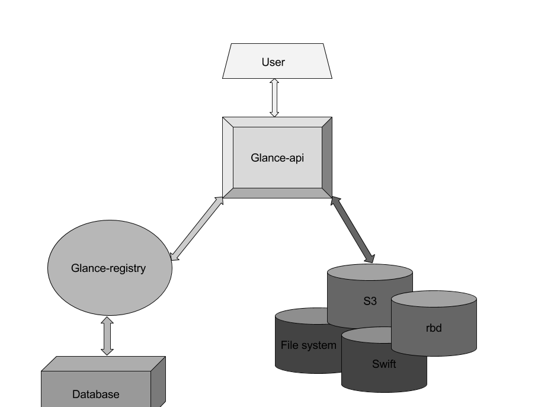
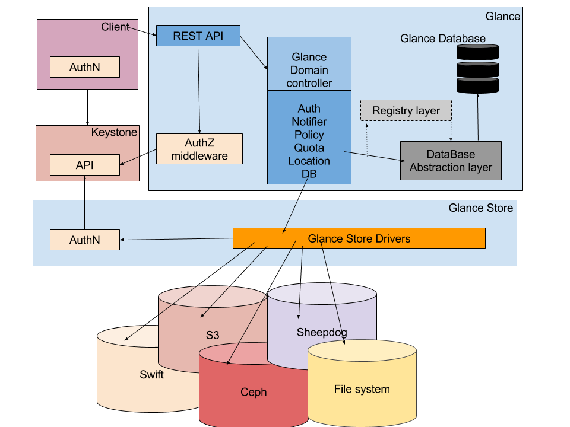

# Tổng quan về Glance

## Mục lục
- [1. Glance là gì?](#1)
- [2. Glance Components](#2)
- [3. Glance Architecture](#3)
- [4. Glance Formats](#4)
- [5. Glane Status Flow](#5)
- [6. Glance Configuration Files](#6)

### 1. Glance là gì?
- Openstack glance là một dịch vụ image mà cung cấp các chức năng: discovering, registering, retrieving for disk and server images.
- VM image được tạo sẵn, thông qua glance có thể được lưu trữ trong nhiều vị trí khác nhau từ các hệ thống tệp tin đơn giản đến các hệ thống lưu trữ đối tượng như là OpenStack Swift project.
- Trong glance, các image được lưu trữ như các mẫu mà có thể được sử dụng để tạo các máy ảo mới. 
- Glance được thiết kế trở thành một dịch vụ độc lập cho những người cần tổ chức các bộ virtual disk images lớn.
- Nó cũng có thể snapshots từ các máy ảo đang chạy để sao lưu trạng thái của VM.

### 2. Glance Components
- Glane có các thành phần sau :
  - Glane-api : Chấp nhận các lời gọi đến API để phát hiện, truy xuất và lưu trữ image.
  - Glane-registry: lưu trữ, xử lý, và lấy thông tin cho image.
  - database : Là nơi lưu trữ metadata của image.
  - storage repository : Tích hợp các thành phần bên ngoài OpenStack khác nhau như hệ thống tập tin thông thường, Amazon S3 và HTTP để lưu trữ image.
  
  
  

### Glance Architecture
- Glance có cấu trúc theo mô hình client-server và cung cấp RESTful API mà thông qua đó các yêu cầu được gửi đến server để thực hiện. Yêu cầu từ các client được chấp nhận thông qua RESTful API và chờ keystone xác thực.
- Glance Domain controller thực hiện quản lý tất cả các hoạt động bên trong. Các hoạt động được chia ra thành các tầng khác nhau. Mỗi tầng thực hiện một chức năng riêng biệt.
- Glane store là lớp giao tiếp giữa glane và storage back end ở ngoài glane hoặc local filesystem và nó cung cấp giao diện thống nhất để truy cập. Glane sử dụng SQL central Database để truy cập cho tất cả các thành phần trong hệ thống.
- Glance bao gồm một vài thành phần sau:
  - **Client**: Bất kỳ ứng dụng nào sử dụng Glance server đều được gọi là client.
  - **REST API**: dùng để gọi đến các chức năng của Glance thông qua REST.
  - **Database Abstraction Layer (DAL)**: một API để thống nhất giao tiếp giữa Glance và database.
  - **Glance Domain Controller**: là middleware thực hiện các chức năng chính của Glance là: authorization, notifications, policies, database connections.
  - **Glance Store**: tổ chức các tác động giữa Glance và lưu trữ dữ liệu khác.
  - **Registry Layer**: Tùy chọn tổ chức một lớp trao đổi thông tin an toàn giữa các miền và các DAL bằng cách sử dụng một dịch vụ riêng biệt.

  
  

### 4. Glance Formats
- Khi upload một image lên glance, chúng ta phải chỉ rõ định dạng của Virtual machine images.
- Glane hỗ trợ nhiều kiểu định dạng như Disk format và Contianer format. 
- Virtual disk tương tự như server’s boot driver vật lý, chỉ tập trung vào trong một tệp tin. Điều khác là Virtualation hỗ trợ nhiều định dạng disk khác nhau.

### 5. Glance Status Flow
- Glane Status Flow cho chúng ta thấy tình trạng của Image trong khi chúng ta tải lên. Khi chúng ta khởi tại một image, bước đầu tiên là queuing. Image sẽ được sắp xếp vào một hàng đợi trong một thời gian ngắn để định danh (hàng đợi này dành cho image) và sẵn sàng được upload. Sau khi kết thúc thời gian queuing thì image sẽ được upload đến "Saving" , tuy nhiên ở đây không phải image nào cũng được tải lên hoàn toàn. Những Image nào được tải lên hoàn toàn sẽ trong trạng thái "Active". Khi upload không thành công nó sẽ đến trạng thái "killed" hoặc "deleted" . Chúng ta có thể tắt và tái kích hoạt một Image đang "Active" hoàn toàn bằng một lệnh.
- Sơ đồ về Glance Status Flow

- Các trạng thái:
  - **queued**: Bộ nhận diện image đã được dành riêng cho một image trong registry Glance. Không có dữ liệu nào trong image được tải lên Glance và kích thước image không rõ ràng sẽ được đặt thành 0 khi tạo.
  - **saving**: Biểu thị rằng dữ liệu của image đang được upload lên glance. Khi một image đăng ký với một call đến POST/image và có một x-image-meta-location vị trí tiêu đề hiện tại, image đó sẽ không bao giờ được trong tình trạng saving (dữ liệu Image đã có sẵn ở vị trí khác).
  - **active**:  Biểu thị một image đó là hoàn toàn có sẵn trong Glane. Điều này xảy ra khi các dữ liệu image được tải lên hoặc kích thước image được rõ ràng để thiết lập được tạo.
  - **deactivated**: Biểu thị rằng quyền truy cập vào Image không được phép truy cập từ bất kỳ ai cả admin-user.
  - **killed**: Biểu thị một lỗi xảy ra trong quá trình truyền tải dữ liệu của một image, và image là không thể đọc được.
  - **deleted**: Trong Glane đã giữ lại các thông tin về image, nhưng không còn có sẵn để sử dụng. Một image trong trạng thái này sẽ được gỡ bỏ tự động vào một ngày sau đó.

### 6. Glance Configuration Files
- **Glance-api.conf**: File cấu hình cho API của dịch vụ image
- **Glance-registry.conf**: Fiel cấu hình cho đăng ký image mà các lưu trữ metadata về các image.
- **glance-scrubber.conf** : Sử dụng tiện ích này để xóa sạch các images mà đã bị xóa. 
- **policy.json**: Bổ sung truy cập kiểm soát áp dụng cho các image service. Trong này, chúng tra có thể xác định vai trò, chính sách, làm tăng tính bảo mật trong Glane OpenStack.
